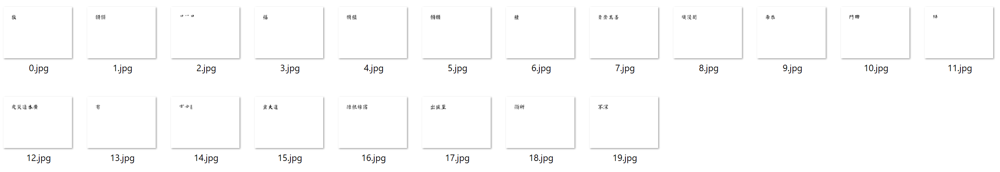

# 汉语古籍OCR最后记录——聚类

目前进度：

对于文字的聚类尝试

## 主成分分析 + K-means

对于前20个主成分，使用k-means的方法进行聚类

为了便于聚类计算，将分割得的文字图片标准化为25x25的大小

如图是对bunko的第19页进行分类的效果

可以看出起到了一定的聚类效果，1.jpg和5.jpg中均成功聚类了“願”字，但在4.jpg中仍有被错误聚类的“願”

k-means存在如下致命缺陷：

- 需要指定k个类簇，在每页不同文字数量n不确定的情况下，很难达到理想的效果：

  - k<n，在聚类精度极高的情况下，一定会出现至少2个不同文字被分为一类
  - k>n，在聚类精度极高的情况下，一定很出现至少1组相同的文字被分为2类

  而保证满足k=n在普遍的k-means算法中是做不到的

  

## 尾记

本项目与2020年秋季开始，至2021年5月结束，中间历时半年多。

后期很长一段时间由于结果的不尽人意，以及其他的一些事情，项目耽搁了。

比如在寒假中，我曾尝试跳过聚类的步骤，而直接使用已有的开源文字识别模型进行训练识别。但是由于对于巨型数据集的处理的经验不足，以及个人PC的非常有限的算力，大部分时间都用在这一条弯路上，最后得出已有的普遍性文字识别模型对于本项目的不适用性：对于我所使用的开源模型，识别准确率几乎为0。

最近阿里达摩院对于古籍识别OCR的较成功的研究成果发布了，他们对于我所遇到的聚类方面的难题的解决方式十分的巧妙：由于古籍中有许多生僻字，可能在整本书中只出现若干次，他们将其通过迁移变换的方式自动生成若干生僻字的训练数据，加入样本中一同训练，以提高对于该生僻字的聚类准确性。

虽然项目没有坚持做到最后，但是在这期间我也学到了很多东西，也有了一些失败的经验，让我有所成长。