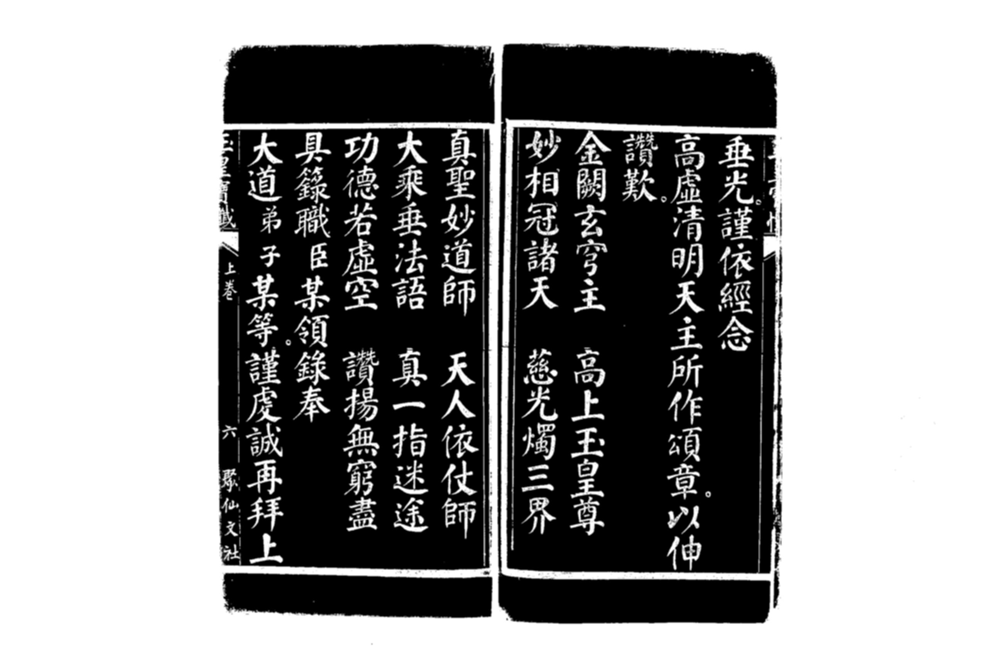
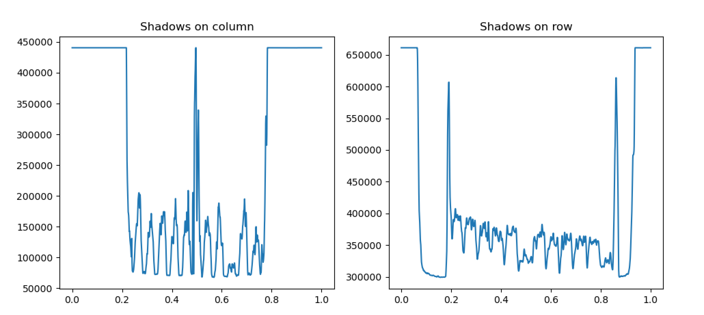
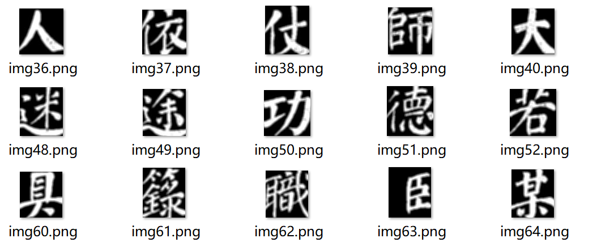
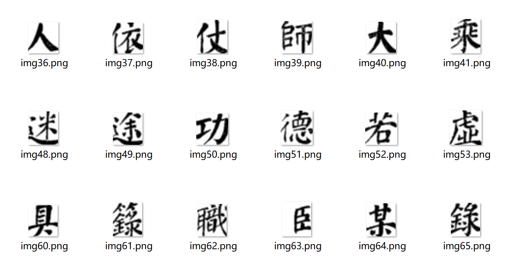

## 汉语古籍OCR第二次记录——分割图片文字

## 图片预处理

为了保证分割的准确性，在分割之前，需要先对图片进行处理，比如二值化，降噪，腐蚀等方法

### 二值化及其他预处理操作Binarization.py

#### 1. 灰度化

为了将图片二值化，首先需要将给出的RGB图片转换成灰度图片

使用OpenCV中的`cvtColor`方法就可以简单实现

```python
grayedImg = cv2.cvtColor(img, cv2.COLOR_RGB2GRAY)
```

这样做的目的是将图片从RGB三值色道转换成0到255的单色道，方便我们进行阈值的选取

#### 2. 二值化的阈值选取

这里我没有一开始使用常用的大津法**(Otsu)**选取阈值，因为在之后的具体二值化操作中可以使用方法提供的Otsu优化方法

我这里采用的方法是**选择整张灰度图片的像素平均值**作为阈值初始值

然后使用OpenCV的`THRESH_OTSU`参数对我的阈值进行优化，相比从0开始或者从普遍的127开始，快速收敛到更好的阈值

#### 3. 二值化

二值化的原理是：

​	**给定一个阈值，将图片中像素值小于阈值的设置为一个值，大于阈值的设置为另一个值**

OpenCV中也给了我们相应的方法`threshold`

```python
retval, dst = cv.threshold(src, thresh, maxval, type[, dst] ) 
```

解释参数：

> src：原图像
>
> dst：结果图像 
>
> thresh：当前阈值
>
> retval：优化后的阈值（如果有优化）
>
> maxval：最大值，一般为255
>
> type: 参数类型

在这里我采用了`THRESH_OTSU`的优化方法，在使用了`THRESH_OTSU`参数后，OpenCV会对阈值进行Otsu方法的优化处理

`THRESH_OTSU`是需要搭配`THRESH_BINARY`、`THRESH_BINARY_INV`、`THRESH_TRUNC`、`THRESH_TOZERO`以及`THRESH_TOZERO_INV`来使用的。并且输入图像必须是灰度图像。

其中`_INV`表示反色，由于在分割尝试中，黑底白字在分割上效果更好，因此我的type参数为`cv2.THRESH_BINARY_INV | cv2.THRESH_OTSU`

最后的二值化代码为

```python
retval, binarizedImg = cv2.threshold(grayedImg, mean, 255, cv2.THRESH_BINARY_INV | cv2.THRESH_OTSU)
```

#### 4. 模糊降噪

这里使用OpenCV库中的均值模糊降噪方法`blur`

```python
#均值模糊降噪法，使用5x5的模糊核
binarizedImg = cv2.blur(binarizedImg, (5, 5))
```

还有其他降噪方法，暂时还没有尝试

- 均值模糊（Averaging blurring）：`cv2.blur`
- 高斯模糊（Gaussian blurring）：`cv2.GaussianBlur`
- 中值模糊（median blurring）：`cv2.medianBlur`
- 双边滤波（bilateral filtering）：`cv2.bilateralFilter`

#### 5. 腐蚀和膨胀

OpenCV库中提供了`erode`方法和`dilate`方法来帮助我们进行图像的腐蚀和膨胀

但是在这里我暂时都没有使用，因为尝试腐蚀和膨胀之后的分割效果都一般，原因是

1. 图像的文字有的较粗，膨胀后就会糊到一起
2. 有的较细，腐蚀后就会很细，乃至出现断笔的情况

这两种情况都是不便于分割的。因此在我的一般性方法中没有使用


处理后的图片




## 图片分割

算法思想是通过投影法，将二维的像素通过对一维求和，投影到另一维上

然后对于得到的投影，会出现明显的文字行/列的波峰或波谷

> 由于我是黑底白字，所呈现的就是波峰为字
>
> 255为白色，0为黑色，当黑底白字，字所在的行就会相比没有字的全黑间隔的像素值求和要高，导致出现文字波峰



这是某一页的行列投影，可以从**左图**看到这张图片除了两页中间的分隔波峰，左页和右页分别有5个波峰，表示有五列，而**右图**从12个波峰可以看到整个图片文字会呈现12行

### 1. 方法1：先分列再分行abandoned_split.py

有了这样的投影结果，我们就可以得到我们的操作目标：**先根据列投影分割出波峰，然后再对每一个分割出的列进行行投影并按照波峰分割**

> 缺点是，对于分割出的列再分割出文字时，由于存在上下结构的文字，导致会出现较多的错误分割，比如“草”分割为“艹”和“早”

解决思路是，由于汉字都是方块字，因此文字的高度与宽度应该近似相等，因此在分割时限制割出的高度必须大于宽度的比如0.9倍，就不会出现上面的碎片分割情况

> 但这带来新的问题，就是当有一个地方分割出错后，会导致后面出现蝴蝶效应，因为限制了切割的高度，导致出错时很大概率会割去下一个字的一部分，导致后面的切割全部出错

### 2. 方法2：直接按行列同时分割splitImg.py

由于汉字排版都是行列对齐的

因此可以对于书籍图片，分开左右两页后，提取文字部分，然后直接行列同时划分，同时处于行列的波峰的就是一个文字

> 缺点也很明显，古人书写时并非完全上下左右对齐，因此会出现略微的错位现象
>
> 但是好在古籍的书写还是比较规范，不会出现太离谱的对齐问题，除了某些特殊的排版格式

### 3. 具体的分割算法

我最后权衡下来选择**方法2**

> 关键提取算法：
>
> 我这里采用一种比较简单的方法
>
> 1. 通过取平均得到我们要分割的二值化图片的投影平均值，再与最大投影像素值取平均，得到一个阈值v
> 2. 遍历一维投影，当投影值小于阈值，且区间开始值start为初始值，记录start为当前下标i，如果投影值持续小于阈值，start不会更新
> 3. 当投影值大于等于阈值，且区间离开值end为初始值，记录区间离开值end为当前下标i，此时得到的start和end为一组，标记着一个范围range，存储此时的start和end，同时更新start和end为初始值以便后面的遍历中继续获取新的range
> 4. 最后得到的一个[start, end]数组即为我们提取到的波峰/谷，也就是文字所在的行/列位置

```python
#算法过程代码
for i in shadows:
    if i < mean:
        if (start >= 0) and (end == -1):
            end = t
            Range.append([start, end])
            start = -1
            end = -1
    else:
        if start == -1:
            start = t
            t += 1
```


分割流程：

1. 使用上面的算法提取图片文字部分，也就是去除图片中书页的空白部分以及书页外的部分
2. 使用方法2和上面的算法提取文字部分的各个文字
3. 将提取到的各个文字反转回白底黑字方便查看

## 分割结果

二值化图片


提取文字部分


分割文字



反色得到白底黑色文字



## 分割效果评估

分割效果是个很难评估的指标

我采用老师的意见，估计正确分割的文字大小范围，判断分割出的文字处于这个范围的比例占总的分割文字个数的比例

>  最后得到bunko的总分割数5408，有效分割数4945，正确率91.44%

但是这个评估方式很不准，大概实际的可能只有80%左右，还有待提高